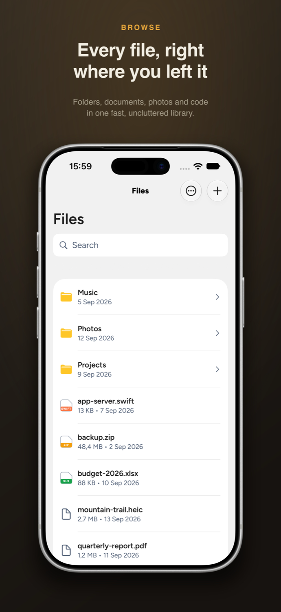
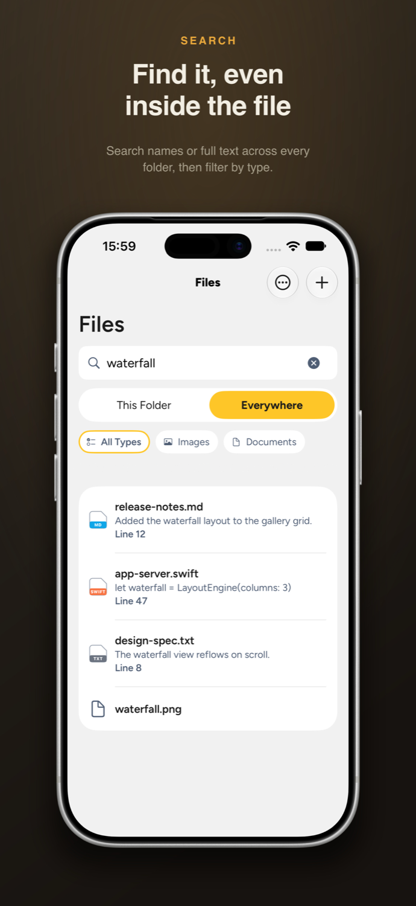
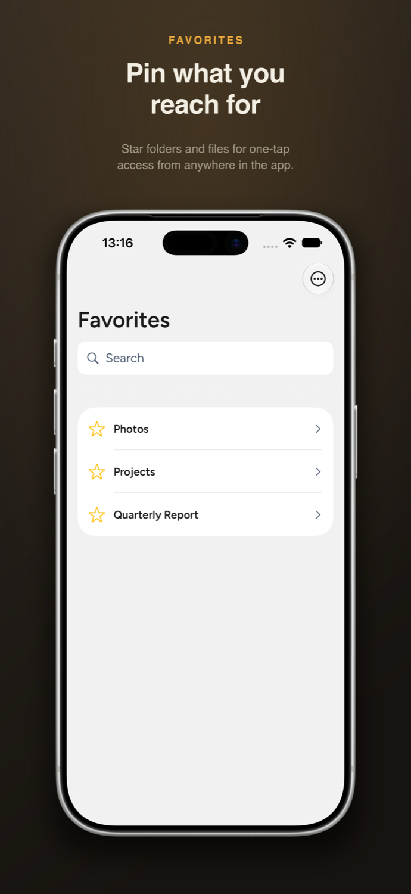
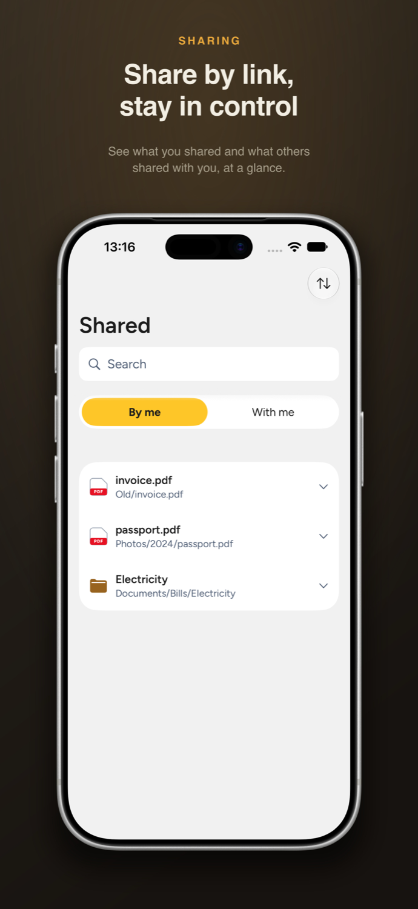
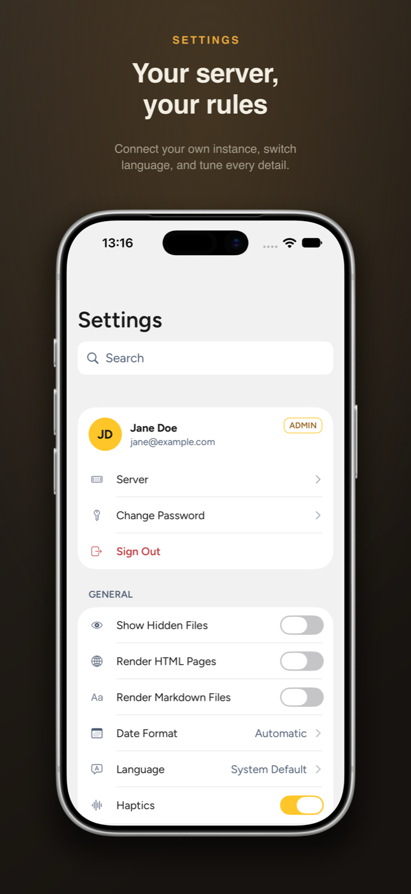

<div align="center">


# NextExplorer for iOS

**Every file, right where you left it.**

A fast, private, native file browser for your own self-hosted server.
Browse, preview, search and share. Your files stay between your device and the server you choose.

<br/>


<br/>

<a href="https://apps.apple.com/app/id6811976306">
  
</a>

</div>

---

<div align="center">

### Your server, your rules.

NextExplorer is a *client*. You supply the address of your own compatible file server and sign in with your own credentials.
No NextExplorer account, no middleman, no tracking. Your files, credentials and activity stay between your device and that server, and nowhere else.

</div>

---

## Snapshots

Raw captures from an iPhone. No mockups, no marketing frames, this is the actual app.

<div align="center">

| Browse | Search | Favorites | Shared | Settings |
|:---:|:---:|:---:|:---:|:---:|
|  |  |  |  |  |

</div>

---

## Features

- **Browse & preview.** Folders, documents, photos, video, code and archives in one clean library, with rich previews and a swipeable media gallery. Non-native media (avi, mkv, webm and more) plays through a built-in VLC-backed player.
- **Find it fast.** Search by name or full text across every folder, then filter by type to jump straight to what you need.
- **Favorites & sharing.** Star what you reach for, share files by link, and see what others shared with you, all in one place.
- **Sign in your way.** Username and password, or single sign-on and passkeys through your own identity provider.
- **Works offline.** A saved-copy view keeps your recent folders readable when the connection drops, then refreshes when you are back.
- **Everyone's app.** 17 languages with full right-to-left support, plus complete VoiceOver and Dynamic Type accessibility.
- **iPhone and iPad.** Universal layout with a split-view sidebar on larger screens.

---

## Under the hood

Native iOS 18+, SwiftUI, and [The Composable Architecture](https://github.com/pointfreeco/swift-composable-architecture). No storyboards driving the app, no UIKit view controllers behind the screens, no third-party analytics. The app is split into focused Swift packages under `Packages/`:

| Package | Responsibility |
|---|---|
| `AppFeature` | App root, tab and window composition, session lifecycle |
| `AuthFeature` / `AuthClient` | Login, SSO, passkeys, session state |
| `FilesFeature` / `FilesClient` | Browse, preview, search, favorites, sharing, offline cache |
| `NetworkClient` | HTTP layer, ETag revalidation, connectivity |
| `CoreModels` | Shared domain models |
| `DesignSystem` | Colors, typography, reusable components |
| `Localization` | 17-language string catalog and live in-app language switch |
| `Keychain` / `AppStorageKeys` | Credential storage and device preferences |

Some choices worth calling out:

- **Phase-driven state.** Each screen load is one `DataPhase` (`idle` / `loading` / `loaded` / `failed`), not a scatter of loading and error booleans.
- **Heavy work stays off the main thread.** Image decode, large reads, parsing and archive work run detached. Downloads stream instead of buffering into memory.
- **Cancellation is not failure.** A tab switch or scroll-away cancels a load cleanly, without flashing an error.
- **Offline cache is fallback-only and account-safe.** Stale-while-revalidate on disk, wiped on every logout, session expiry and fresh sign-in, so one account's data never leaks into the next.

Full rules live in [`CLAUDE.md`](CLAUDE.md).

---

## Building from source

1. Install Xcode 16 or later.
2. Clone the repo:
   ```sh
   git clone git@github.com:PhillipMaizza/NextExplorer-iOS.git
   cd NextExplorer-iOS
   ```
3. Open `NextExplorer.xcodeproj`, pick the **NextExplorer** scheme and an iOS 18+ simulator or device, then Run.

Swift Package Manager resolves every dependency on first build; nothing to install by hand. Run the tests with `Product > Test`, or `xcodebuild test` against a matching simulator.

To try it against real data you need a compatible self-hosted server and an account on it.

---

## Contributing

Contributions are welcome. See [`CONTRIBUTING.md`](CONTRIBUTING.md) for the branch and PR conventions and the architecture rules (constants, concurrency, state modelling, localization and cache safety) that every change follows.

---

## Privacy

The app talks only to the server you point it at. No analytics, no third-party trackers, no telemetry. Cached copies are cleared on logout, session expiry and fresh sign-in.

See the [Privacy Policy](https://phillipmaizza.com/nextexplorer/privacy) and [Terms of Use](https://phillipmaizza.com/nextexplorer/terms) for the full text.

---

## Support

Questions, a bug, or a feature idea? Open an issue on this repo, or reach out through the [support site](https://phillipmaizza.com/nextexplorer). Replies usually land within a couple of days.

---

## License

Copyright © Phillip Maizza. All rights reserved. This source is published for review and reference; it is not currently offered under an open-source license. If you would like to reuse part of it, get in touch.
